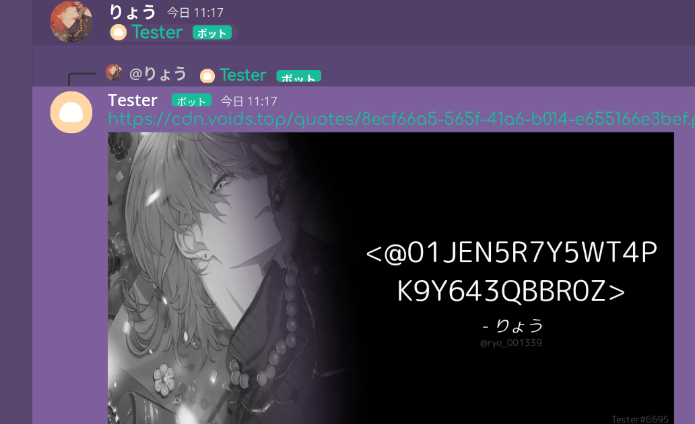

# RevoltBOT
[](https://npmjs.org/package/revolt.js)
[](https://npmjs.org/package/revolthandler.js)
[](https://npmjs.org/package/makeitaquote)
<br>
Revolt.chatで使用できるBOTです。Revolt.jsで書いています
# 使い方
.envを作成します
```
REVOLT_TOKEN= revoltのBOTのTOKENを入れる
```

config.jsonに必要事項の記入。
- owner : 自分のユーザーID
- prefix : コマンド用のプレフィックス
- watermark : make it a quoteの画像の右下に配置する文言。基本BOTのユーザー名でいいとおもう
```json
{
    "owner": "00000000000000000",
    "prefix": "r^",
    "watermark": "Test#0000"
}
```
必要なパッケージのインストール
```
npm i
```
実行
```
npm start
```

# コマンド
## Make it a Quote
### 通常
リプライ時に{BOTにメンション}をすれば生成されます<br>

### カラー
リプライ時に{BOTにメンション} colorと送ればカラーで生成されます<br>

## Userinfo
r^userinfo {ユーザーをメンション}すればメンションされたユーザーの情報が表示されます<br>

## ping
r^pingと送信するとpongを返すだけです<br>
